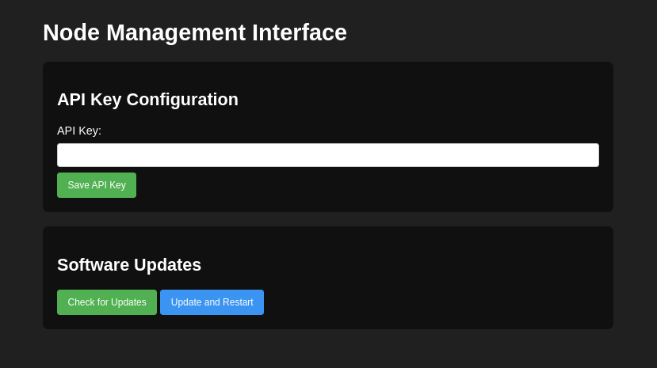

# Olympus Node

### RTL-SDR Compatible

**Version 0.1.0**

> **Note**: Acquiring an API key is currently exclusive to members of the beta testing group. Public access will be available soon.


## Installation

1. **Clone the Repository**

   ```bash
   git clone https://github.com/fosatech/olympus-node
   cd olympus-node
   ```

2. **Set Up a Virtual Environment**

   ```bash
   python -m venv .venv
   source .venv/bin/activate
   ```

3. **Install Dependencies**

   ```bash
   python -m pip install -r requirements.txt
   ```

4. **Install librtlsdr-2freq for TDOA Capability**

   ```bash
   git clone https://github.com/DC9ST/librtlsdr-2freq.git
   mv librtlsdr-2freq .librtlsdr-2freq
   ```

   Navigate to the `.librtlsdr-2freq` directory and follow the installation instructions provided in its README.

## Running the Olympus Node

1. **Start the Application**

   ```bash
   python run.py [RTL-SDR Device Index (usually 0)] [Config console port, e.g., 5000]
   ```

   - Replace `[RTL-SDR ID]` with the device index of your RTL-SDR
   - Replace `[Config console port]` with the desired port

2. **Access the Web Interface**

   - Open a browser and navigate to `http://<your local IP>:5000` (e.g., `http://192.168.1.100:5000`).
   - Enter your API key, obtainable from olympus.fosa-tech.com/account after creating a node.

3. **Check for Updates**

   - In the web interface, click the **Update** button to check for available updates.

    

## Support

For assistance, please visit our contact page.
